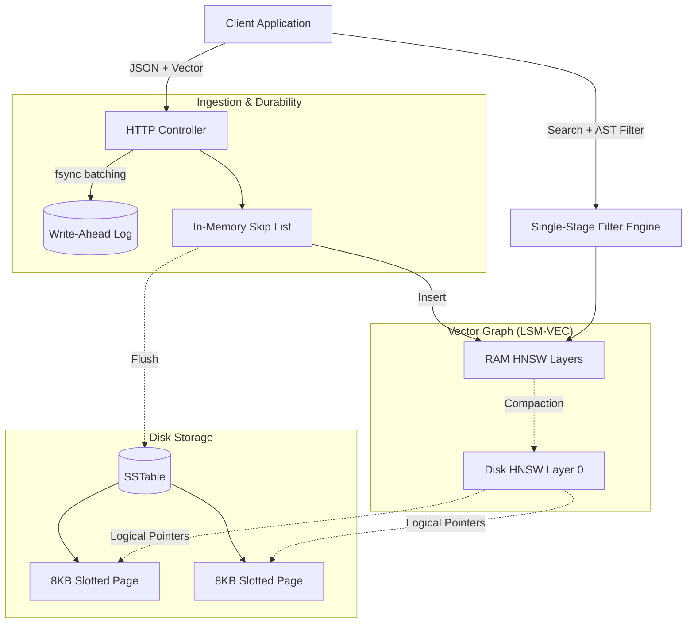

# NPKDB Architecture

NPKDB is a high-performance, AI-native multi-model database specifically designed to resolve the limitations of traditional database architectures in the context of Retrieval-Augmented Generation (RAG) pipelines and multi-modal embeddings. Written in Nitpick, it leverages deterministic memory management, lock-free concurrency, and hardware SIMD acceleration to achieve extreme throughput without garbage collection latency spikes.

## 1. Single-Stage Filtering

The most computationally expensive operation in a vector database is a filtered Approximate Nearest Neighbor (ANN) search (e.g., "Find the nearest vectors WHERE category = 'finance'"). Traditional architectures typically employ one of two flawed strategies:
- **Pre-filtering:** Evaluating the metadata filter first to generate a bitset of allowed IDs, then searching the vector graph. A highly restrictive filter severs the connections in the HNSW graph, trapping the search in local minima and destroying recall.
- **Post-filtering:** Performing a broad vector search first, then discarding results that fail the metadata predicate. This wastes massive amounts of CPU cycles calculating distances for invalid vectors.

NPKDB implements **Single-Stage Filtering** (also known as Integrated Filtering). Metadata predicates are embedded directly into the HNSW graph routing mechanism. As the algorithm traverses the vector space, it concurrently evaluates the abstract syntax tree (AST) of the JSON metadata filter. When encountering a node that fails the filter, the algorithm dynamically routes *around* it using specialized traversal links, maintaining graph connectivity and ensuring high recall without wasted computation.

## 2. Storage Substrate: LSM-Tree and Slotted Pages

To handle the extreme write throughput generated by continuous AI ingestion pipelines, NPKDB utilizes a Log-Structured Merge-Tree (LSM-Tree) instead of a traditional B-Tree.

1. **Write-Ahead Log (WAL):** Mutations are first appended sequentially to a WAL, utilizing group commit batching to optimize `fsync` system calls. This guarantees ACID durability.
2. **Memtable:** Data is simultaneously buffered in a highly concurrent, lock-free Skip List residing in RAM.
3. **SSTables & Slotted Pages:** When the Memtable reaches its capacity threshold (`storage.memtable_flush_bytes`), it is flushed to disk as an immutable Sorted String Table (SSTable). Within the SSTable, data is physically arranged into 8KB **Slotted Pages**. 
   - A Slotted Page contains a header, a forward-growing array of lightweight slot pointers, and backward-growing variable-length tuples (JSON documents and serialized vectors).
   - This indirection allows internal defragmentation and updates to occur transparently, without invalidating the external pointers held by the vector graph.

## 3. The LSM-VEC Integration

Standard HNSW implementations demand that the entire graph and all floating-point vectors reside in RAM, resulting in prohibitive infrastructure costs for billion-scale datasets. NPKDB solves this via the **LSM-VEC (Log-Structured Merge Vector)** pattern.

The HNSW graph spans the memory-disk boundary:
- New vector insertions are captured in a volatile, memory-resident Memtable graph.
- During compaction, the lowest and most dense layer of the graph is flushed to the LSM-Tree on disk.
- The upper routing layers of the HNSW graph remain locked in fast RAM to ensure the initial expansive search hops incur zero disk latency.

When the search descends into the dense disk layer, NPKDB utilizes **Connectivity-Aware Reordering**. Background compaction threads analyze edge traversal probabilities and physically co-locate connected vectors into contiguous blocks within the Slotted Pages. This transforms what would be random disk I/O into highly efficient, sequential OS page-cache reads.

---

## Architectural Data Flow

The following diagram illustrates the ingestion pipeline and how the Memtable interfaces with the Single-Stage Filtered HNSW Graph and the Slotted Page storage.

